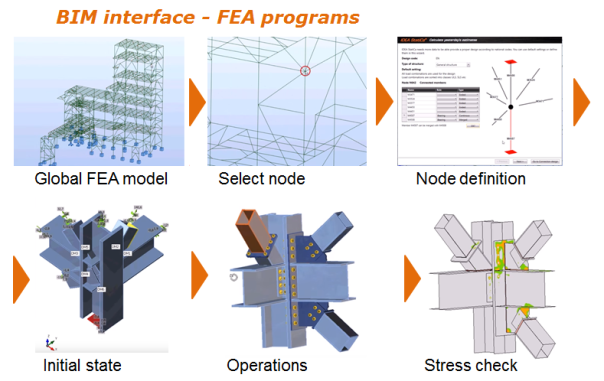

# IDEA Open Model - IOM
IOM interface can be used for the implementation of the link of any application with IDEA StatiCa products. For example IOM interface can be used for the implementation of the link of FEA software with IDEA StatiCa products like Connection or Beam.

The Structure model is an internal description of a designed structure which is used in Idea StatiCa. It contains information about geometry of members, cross-sections, materials etc. as well as loading.

The classes in the public assembly IdeaRS.OpenModel correspond to the internal classes of IDEA Structural Model (SM). IOM objects are small and do not contain any object references among themselves. Simple numerical identifications (id) are used for relations between objects. In fact, the IOM looks like Relation Database.

Results which were generated by a FEA application (internal forces) can be optionally saved as in the format of IdeaRS.OpenModel.Result.OpenModelResult. It contains internal forces on the Member1Ds. The relationships between the IOM and the IOM Results are defined by Id of objects.

### IDEA StatiCa API
There is the documentation of [IdeaRS.OpenModel](iom-api/index.html).

### Coordinate system, forces
There is the description of [the coordinate system and the convention of forces](iom-api/coord-system.md) wich are used in IDEA Open Model.

### Samples
* Create [Concrete beam](samples/idea-beam/idea-beam.md) in C# 
