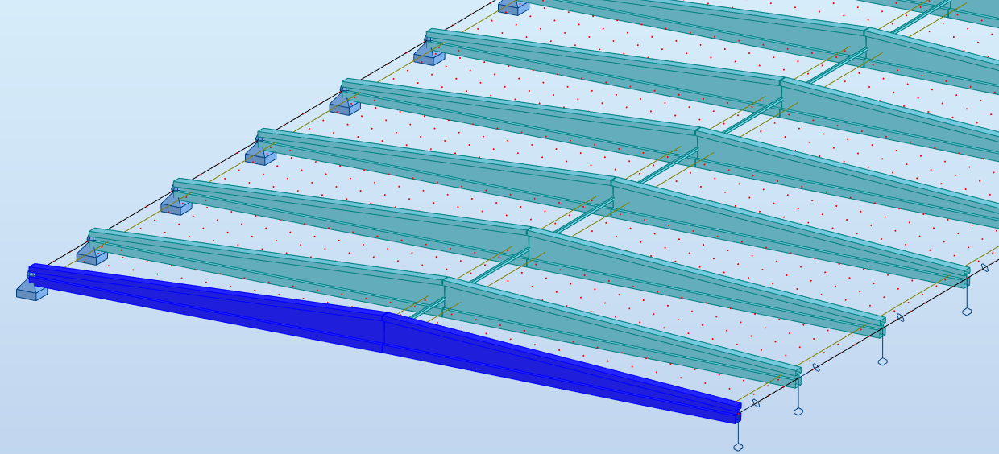
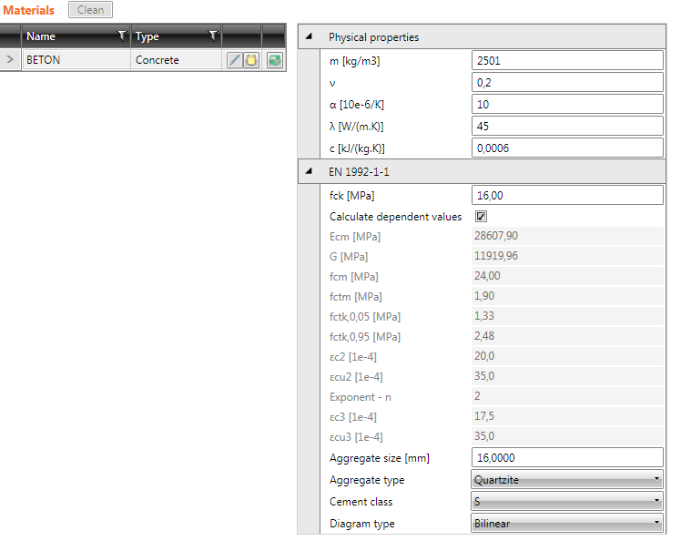
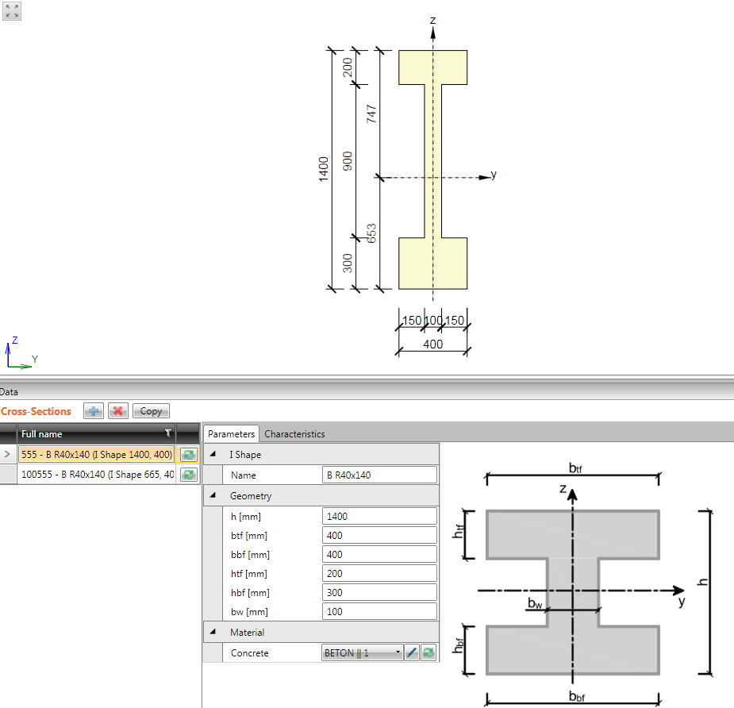
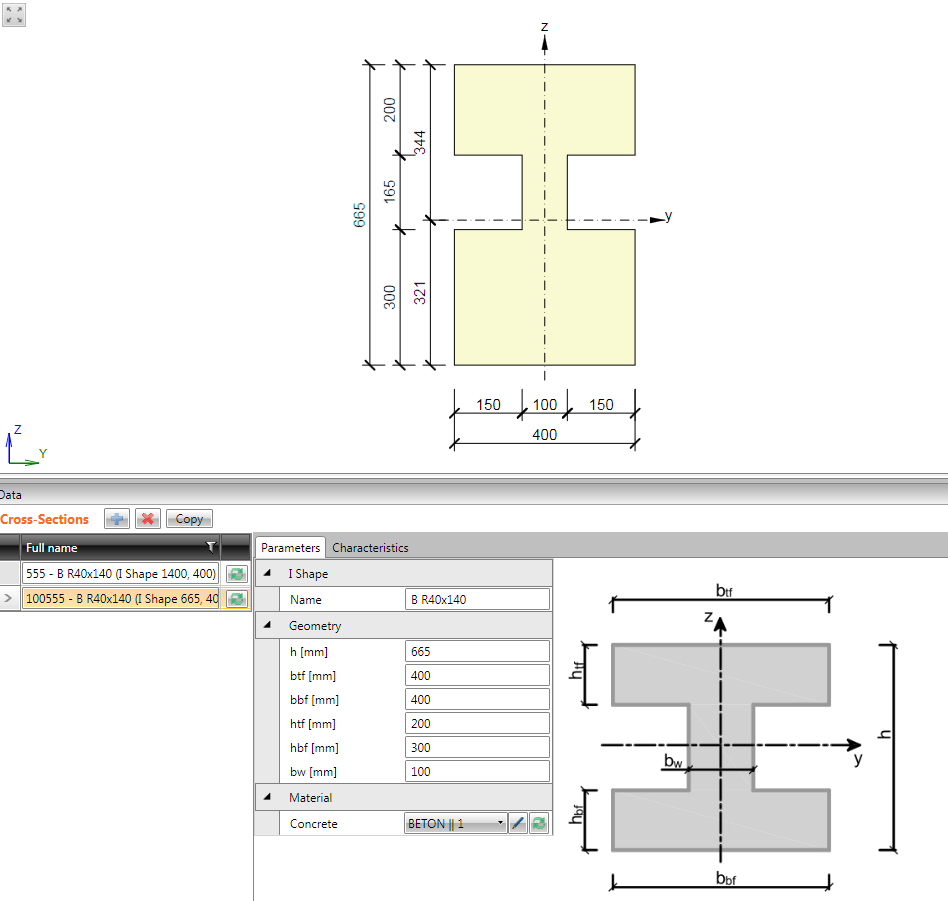
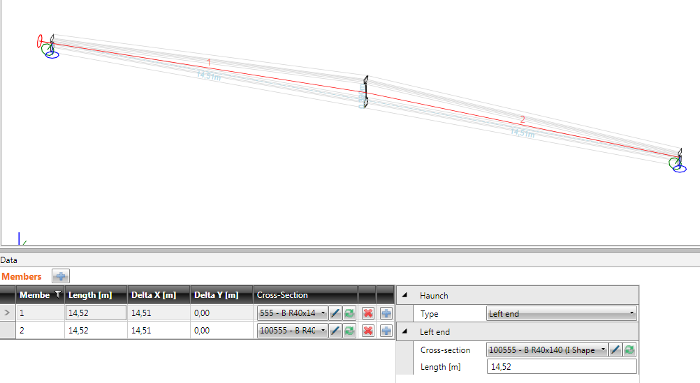
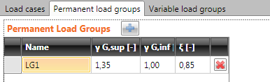
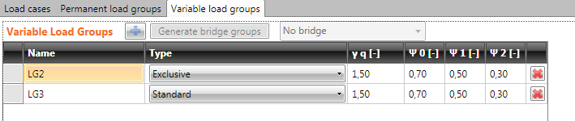
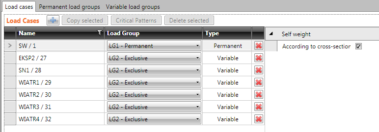

## Sample
The sample describes how to create the IOM and the IOM Results programmatically in the c# language code.
In the followed picture, there is an original beam in the application.

 

## Sample code
The project sample **BeamSampleIOM** is the console application. It creates xml files with the IOM and the IOM Result data. The name of xml file of the IOM must be set as a parameter of this application. The name of xml file of the IOM Results is the same as the xml file with IOM but extension contains letter “r” at the end.
The project contains the c# class **BeamSampleIOM** (BeamSampleIOM.cs), which provides the IOM and IOM Results for this sample.

Method **GenerateIOM()** compiles of the IOM. 
This method contains these methods:
### CreateSettings()
-	Compiles base data of project
### CreateGeometry()
-	Compiles the 3D geometry
-	Points
-	Lines
-	Polylines
### CreateMaterials()
-	Compiles the materials

 

### CreateCrossSections()
-	Compiles the cross-sections

 
 

### CreateModel()
-	Compiles the structural model
-	Elements
-	Members
-	Beams
-	Supports

 

### CreateLoad()
-	Compiles the loading data
-	Load groups

 
 

-	Load cases

 

-	Combinations

Method **GenerateIOMResult()** compiles of the IOMResults. 
