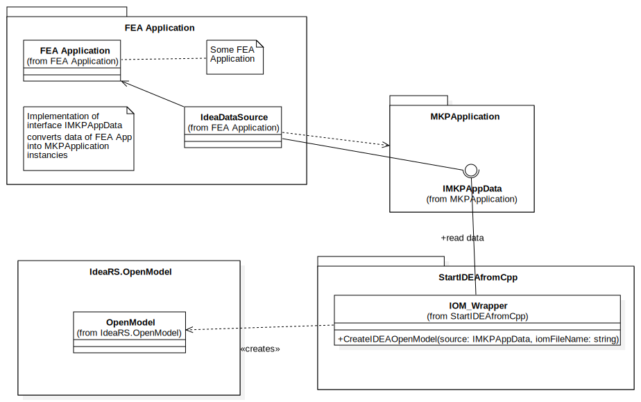

# Usage from C++ code
The sample describes how to create the IOM and the IOM Results programmatically in the C++/CLI language code.

## Sample code
In the solution *AllSamples.sln* you can find folder *cpp* for C++ samples. It includes 4 projects:

1. **MKPApplication** – The native dll which inludes definitions of types which are needed for passing data from any FEA application into Idea StatiCa. You only need to implement the interface *IMKPAppData* in your application. Your implementation is reponsible for writing your internal data into corresponding instances of classes from **MKPApplication**.

2. **StartIDEAfromCpp** – The assembly written in C++/CLI. The class **IDEARS::IOM\_Wrapper** is responsible for creating instances of IOM or IOM Results from data which are provided by *IMKPAppData*

3. **StartIDEAfromCppApp** – The sample C++ application which shows how to use *IMKPAppData* and *IDEARS::IOM\_Wrapper* - see the implementation of class **IDEA\_Caller**

**IDEA\_Caller::StartIDEA(IMKPAppDataPtr pMKPData)**

```
// creates the IOM from data which are provided by pMKPData and save it in file pszFilePath
IDEARS::IOM\_Wrapper^ wrapper = gcnew IDEARS::IOM_Wrapper(pszFilePath);
wrapper->CreateIDEAOpenModel((void*)pMKPData);

// create ideaCon project from IOM in stored in the file pszFilePath and open it
// in the application IdeaConnection
IDEARS::IDEAConnectionStart^ run = gcnew IDEARS::IDEAConnectionStart();
run->Run(myideaInstallDir, pszFilePath);

```

**IOM\_Wrapper::CreateIDEAOpenModel(void\* pMKPData)**

Create IOM and IOM results

**IDEAConnectionStart::Run(String^ ideaInstallDir, String^ pszFilePath)**

Start IdeaStatiCa Connection

<br/>
