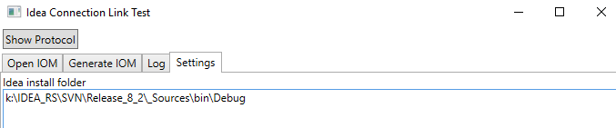
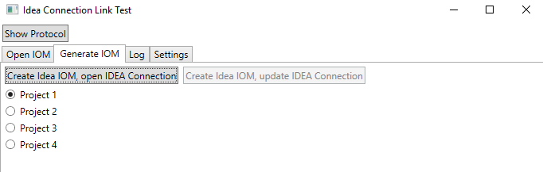
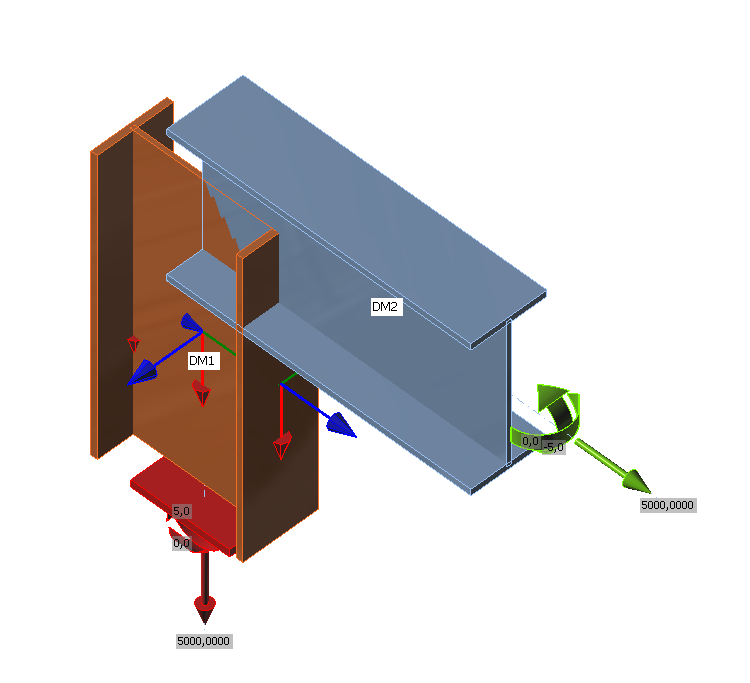
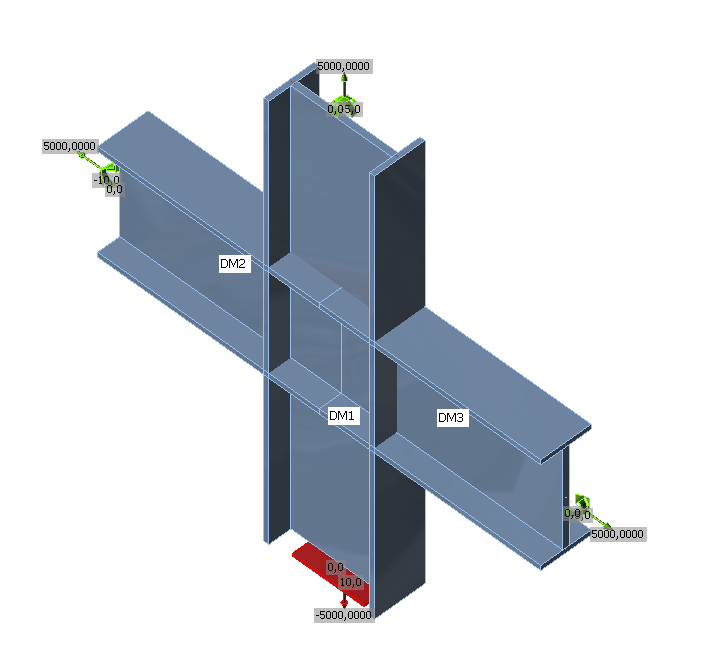
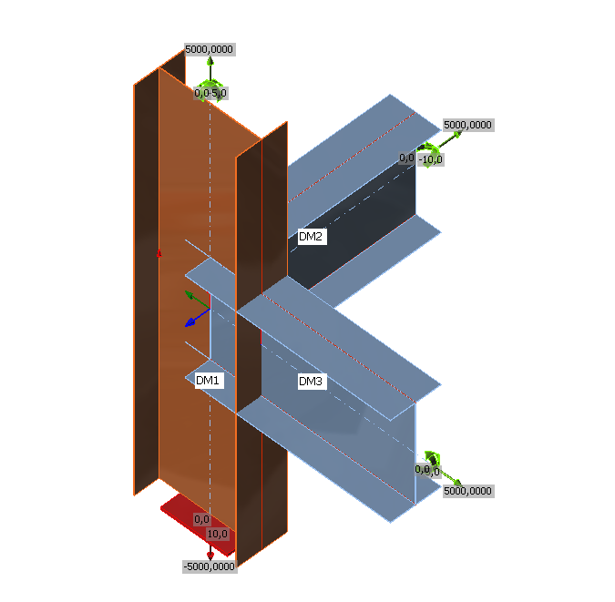
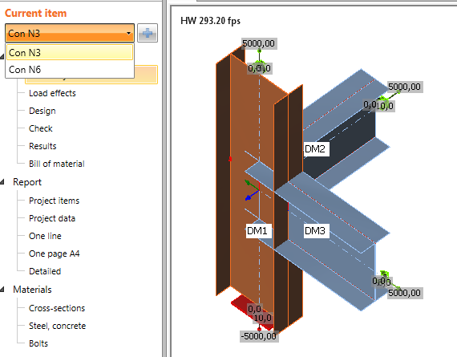
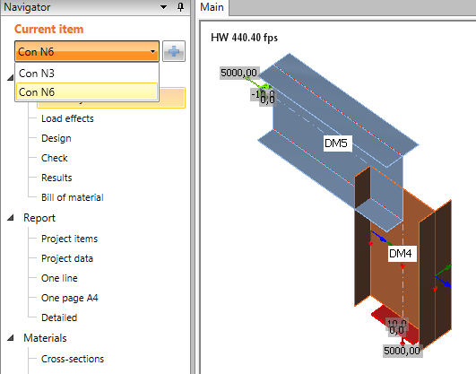

# Sample application how to create IOM

This sample describes how to create the IOM and the IOM Results programmatically in the C# , VB.NET, or C++ language code.

Open project *Samples\AllSamples.sln*

This solution contains:

## IOM\_IDEAConnectionRunnerTestApp

The basic idea of this example is start application *IOM\_IDEAConnectionRunner.exe* with .ini file as its parameter. You are able to debug the code to see how to fill IOM.

## IOM\_IDEAConnectionRunner\_VB\_TestApp

The same example but for VB.NET

Example of .ini file for new project:

```
SETTINGS;NEWPROJECT
OUTPUTFILE;k:\Example\Projects\mepSjIni.ideaCon
USEWIZARD;TRUE
WAITFOREXIT;FALSE
IOM;k:\IDEA\_RS\Projects\BugFix32\Melody\mepSjIni.xml
```

Example of .ini file for update of project:

```
SETTINGS;UPDATEPROJECT
OUTPUTFILE;k:\Example\Projects\mepSjIni.ideaCon
USEWIZARD;TRUE
WAITFOREXIT;FALSE
IOM;k:\IDEA\_RS\Projects\BugFix32\mepSjIni.xml
```

## Cpp
It contains example how to create IOM file from C++ code. More details you can find in this [document](connection-cpp.md).

## ConnectionLinkTestApp

For starting Connection this part of code is used:

```
string ideaConLinkFullPath = System.IO.Path.Combine(ideaInstallDir, "IdeaRS.ConnectionLink.dll");
var conLinkAssembly = Assembly.LoadFrom(ideaConLinkFullPath);
object obj = conLinkAssembly.CreateInstance("IdeaRS.ConnectionLink.ConnectionLink");
dynamic d = obj;
```

You cannot debug this code. It is used for faster communication with IDEA StatiCa

At first, set Idea applications installation folder on the **Settings** tab.

<br/>

TabItem **Generate IOM**

<br/>

**Create Idea IOM, open IDEA Connection** – Creates IOM according to settings (Project 1 .. 4) and runs IDEA Connection app.

**Create Idea IOM, update IDEA Connection** -  Opens IOM file from the local storage, update IDEA Connection project and starts IDEA Connection app.

TabItem **Open IOM**

**IOM File** - Select IOM file *(.xml)* from the local storage

**Connection Template / Project** – IOM project can be updated by template.

**Run Idea Connection**  - Starts IDEA Connection app

**Update IDEA Connection** – Update  IDEA Connection  project by new IOM file (.xml) and open IDEA connection app

## Examples

### Example 1 – knee connection

Example is in IOMGenerator

There are 3 nodes and 2 members in the project. IPE rolled section and welded I-section are used. Internal forces N, Vz, My are defined.

|   | **Begin node** | **node** | **End node** | **CSS** |
| --- | --- | --- | --- | --- |
| M1 | N1 |   | N2 | IPE200 |
| M2 | N2 |   | N3 | Welded I |

|   | **X [m]** | **Y [m]** | **Z [m]** |
| --- | --- | --- | --- |
| N1 | 0 | 0 | 0 |
| N2 | 0 | 0 | 3.6 |
| N3 | 6 | 0 | 3.6 |

Connection is created in the node N2.

<br/>

### Example 2 - 2 beams connected to the column

Example is in IOMGenerator2

There are 5 nodes and 3 members in the project. Welded I-sections are used. Internal forces N, Vz, My are defined.

|   | **Begin node** | **node** | **End node** | **CSS** |
| --- | --- | --- | --- | --- |
| M1 | N1 | N3 | N5 | Welded I |
| M2 | N2 |   | N3 | Welded I |
| M2 | N3 |   | N4 | Welded I |

|   | X [m] | Y [m] | Z [m] |
| --- | --- | --- | --- |
| N1 | 3.0 | 0.0 | 0.0 |
| N2 | 0.0 | 0.0 | 3.6 |
| N3 | 3.0 | 0.0 | 3.6 |
| N4 | 6.0 | 0.0 | 3.6 |
| N5 | 3.0 | 0.0 | 7.2 |

Connection is created in node N3

<br/>

### Example 3 - 2 beams in one column

Example is in IOMGenerator3

|   | **Begin node** | **node** | **End node** | **CSS** |
| --- | --- | --- | --- | --- |
| M1 | N1 | N3 | N5 | Welded I |
| M2 | N2 |   | N3 | Welded I |
| M2 | N3 |   | N4 | Welded I |

|   | X [m] | Y [m] | Z [m] |
| --- | --- | --- | --- |
| N1 | 3.0 | 0.0 | 0.0 |
| N2 | 3.0 | 3.0 | 3.6 |
| N3 | 3.0 | 0.0 | 3.6 |
| N4 | 6.0 | 0.0 | 3.6 |
| N5 | 3.0 | 0.0 | 7.2 |

Connection is created in node N3

<br/>

### Example 4 - 2 connection in one project

Example is in IOMGenerator4

|   | **Begin node** | **node** | **End node** | **CSS** |
| --- | --- | --- | --- | --- |
| M1 | N1 | N3 | N5 | Welded I |
| M2 | N2 |   | N3 | Welded I |
| M3 | N3 |   | N4 | Welded I |
| M4 | N4 |   | N6 | Welded I |
| M5 | N5 |   | N6 | Welded I |

|   | X [m] | Y [m] | Z [m] |
| --- | --- | --- | --- |
| N1 | 3.0 | 0.0 | 0.0 |
| N2 | 3.0 | 3.0 | 3.6 |
| N3 | 3.0 | 0.0 | 3.6 |
| N4 | 6.0 | 0.0 | 3.6 |
| N5 | 3.0 | 0.0 | 7.2 |
| N6 | 6.0 | 0.0 | 7.2 |

Connection is created in node N3

Connection **Con N3**

<br/>

Connection is created in node N6

Connection **Con N6**

<br/>
